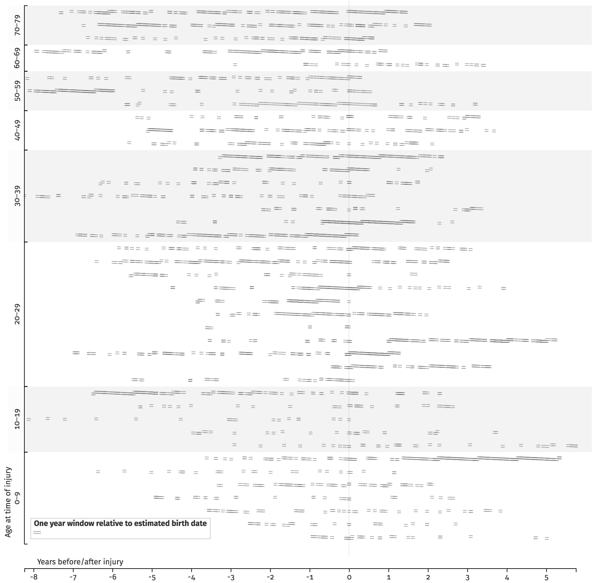
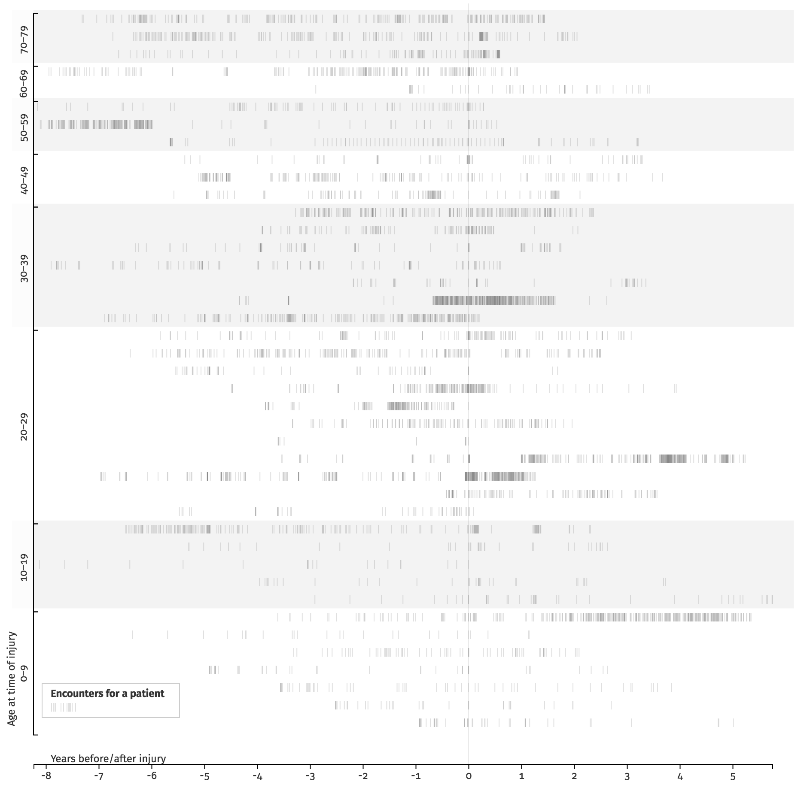
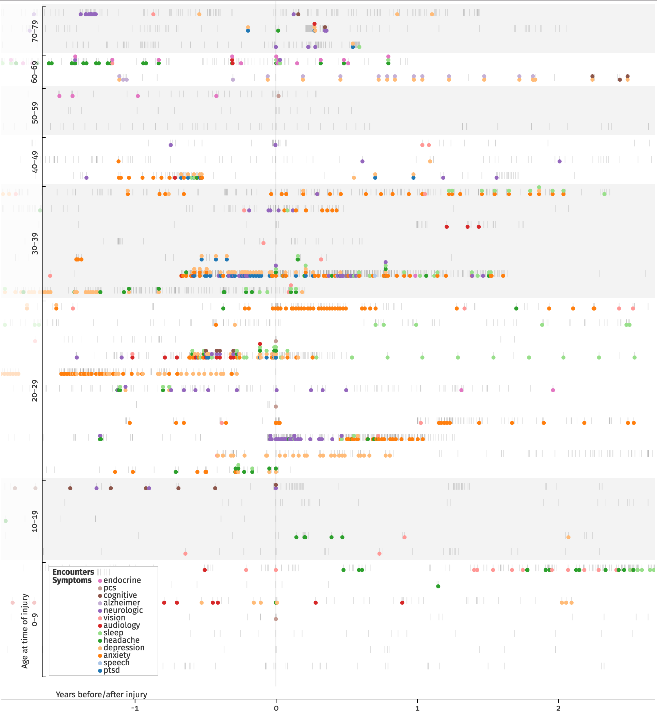
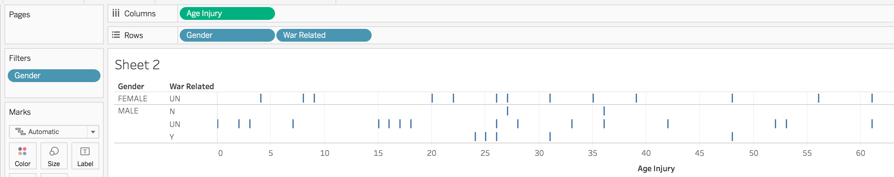

# Assignment 1: Visualization Construction

[Assigment statement](https://sites.google.com/a/umbc.edu/datavisualization/assignments/asgn1) 

## Part 1: Tool Overview

### [Tableau Public](https://public.tableau.com/s/)

Tableau is very quick to get started with. I was able to import the CSV EHR
data and it automatically identifies what data can be used as a dimension and
what is a measurement. It also identified data types for each piece of data
(although I couldn’t get it to treat the symptoms as booleans).  Creating
graphs is also quick by simply dragging data onto a central work area.
Creating derived data is also pretty straightforward by creating functions that
involve other fields. 

The difficulties started to crop up when I tried making sense of the EHR data
and graphs. The data is a bit tricky because it’s hierarchical, but flattened
to a two dimensional spread sheet with redundant data. There looks to be a way
to describe heirarchy in Tableau, but I was not able to figure it out. So in the
end, it was easy to create pretty graphs, but I’m not sure if what I was graphing
actually made sense or if the duplication and hierarchy present in the data was
throwing off everything.

### [D3.js](https://d3js.org/)

D3 was a very different experience. It was much harder to get started. It supplies
you with the basic primitives to manipulate data, bind it to DOM elements and use
that bound data to create and manipulate DOM elements. It is very capable, but
even simple things like creating a legend, or creating non-standard axes was
challenging. But because it’s all Javascript programming, I never felt stuck and I
always had a clear understating of what was going on with the data. It was
just sometimes frustrating how seemingly simple things could not be
expressed simply in D3.

I also found that data joining or binding to be a bit tricky. It one of the core
principles of D3 and creating declarative visualizations, but it’s been a bit hard
to wrap my mind around.

But in terms of flexibility and customization D3 really shines. Everything that
can be represented in Javascript can be done with D3. There are no canned visualizations,
but rather functions that help manipulate data and manipulate the DOM based on that
data. There are also tons of tutorials and examples online.

## Part 2: Visualizations

I chose to work with the traumatic brain injury electronic health record data.
As multi-dimensional data it is most similar to data found in InfoSec—what I
plan on working on for the final project.

The first step was to covert the data from rows of encounters to something
that’s organized by patients. I wrote a [small script](data/to-json) to create
a JSON object keyed by patient ID with information about the injury as well as
an array of encounters. Along with this, I normalized the date and flags. I also
did a number of sanity checks that the patient and injury information didn’t
change between encounters. The gender field had some defaulted values that had
to be cleaned up as well. Otherwise the data looked consistent. That is until
I started looking at the ages at each encounter and time of injury.

### [Vis 1: Patient Age Consistancy Check](https://bl.ocks.org/esturcke/510d67c32b5949e55aaee750a6534113)

The first visualization grapples with possible the age inconsistencies. For each
encounter I calculated a 1 year window of possible birth dates based on the age
at encounter and the date of encounter. Sweeping over all encounters closes
that window. It turns out that there is actually no inconsistency in the ages
(i.e. this window does not go to 0 for any patient). 

It did turn out to still be interesting to graph these windows relative to the mean
date within the windows of possible birth dates. The relative windows for each
encounter have a step with a 1 year period. This would allow the birth date to
be reconstructed with even higher accuracy (assuming we know if the ages at the
time of encounters were rounded down as is typically when self reporting age or
if it was rounded to the nearest integer as might be the case if the ages were
calculated based on the actual birth date.

### [Vis 2: Encounter Frequency Before and After Injury](https://bl.ocks.org/esturcke/cb2b6ee34b6e9eb4fc3b21979a031762)

The second vis shows the frequency of encounters before and after the injury. Each
encounter is represented by a faint vertical bar so that more frequent encounters
can be represented by darker areas. The task here is to which patients have had sudden
increases in visits post trauma and which have had little increase.

There are some patients where the frequency of visits increased priory to the injury
and some where the encounters increased months to a year before the injury. This
could point to bad data, or that there is a secondary injury/illness, that might
also account for symptoms reported.

### [Vis 3: Symptoms Before and After Injury](https://bl.ocks.org/esturcke/65673642c2221dd7f0ef428e13ab782b)

The third vis tries to look at the data holistically by plotting the symptoms
recorded at each encounter both before and after the injury. The task is to gain
an overall understanding of the data and begin to identify trends of
symptom/injury relationships.

This vis took by far the longest. As described above, it started with
manipulating the data to captures the hierarchy of symptoms belonging to
encounters which in turn belong to patients.

I then worked on displaying each encounter by time relative
to the injury and age of the patient at the time of injure. I made some changes
to the vertical axis to group patients into age groups rather than by specific age.
The age is still captured by patient order, but the grouping prevents overlaps
across patients. As an added bonus, the vis captures age demographic information
by the width of each of the groups.

Finally, I added the symptoms at each encounter, coded using color. With 12
symptoms (stress was excluded as it was false for all patients/encounters), this
is pushing the limits describing categorical data with color. Additionally, the
encounters are very dense and so there is a lot of overlap between symptom
dots.

Still, you can pick up on trends of encounter density after injuries for some
patients, whereas others already were having many encounters. Similarly with
symptoms, some patients and a pretty strong increase in symptoms starting right
after the injury, while others had many symptoms before the injury as well.

### Vis 4: Age/Gender/War Related Injury Demographics

The first 3 visualizations much longer than anticipated so I switched to something simpler.
I gave Tableau another chance to look at some simple demographics data. The task is to
understand the demographic distribute. Importing the data was quick and simple.
I then dragged age, gender and war related onto the sheet and it built a quick
visual table. I filtered out the unknown genders (although as discussed above
this could be reconstructed). I’m not confidant about interpreting the data since each
line could correspond to multiple patients.

I then discovered that I could create a mark corresponding to the count of distinct IDs.
I assigned this count to the size. This gives some indication when there are multiple
patients injured at the same age. I might have preferred a cluster of equal sized dots since
the counts of patients is very small, but I couldn’t figure out how to do that.

### The Good and the Bad

#### Tableau

Tableau tries to classify the different types of data and can make inferences
and suggest ways to visualize based on those data types.

 - **Good**: Tableau detects the data types and based on that can structure
   visualizations appropriately.
 - **Good**: Simple yet powerful drag and drop interface.
 - **Bad**: If the data structure is not straight forward, it’s difficult to
   manipulate Tableau to capture the data correctly.

#### D3

With D3, you describe every aspect of going from data to visualization. In my
experience, this is the reason for both the good and the bad. 

 - **Good**: D3 is extremely flexible and you can describe every aspect.
 - **Good**: Because you are describing every aspect, you maintain a very clear
   awareness of how the data is being maipulated and the vis is being
   generated.
 - **Bad**: D3 only gives you convenience functions for data manipulation,
   binding data, and describing how the data gets transformed into the visual
   form. This leaves a lot of work to the person creating the vis. 

