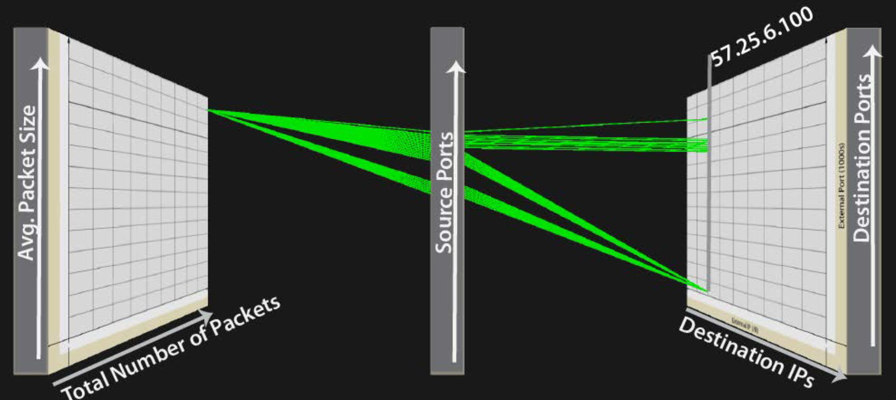

# Parallel 3D Coordinate System

Nunnally, T., & Abdullah, K. (2013). NAVSEC: a recommender system for 3D network security visualizations. *Proceedings of the Tenth Workshop on Visualization for Cyber Security - VizSec ’13*, 41–48. Retrieved from http://dl.acm.org/citation.cfm?id=2517963

The visualizations above show network connections between two hosts and the
ports used, along with package size and number of packets. It uses a modified
parallel coordinate system where two of the axes are not parallel, but placed
in a 3rd dimension. The first shows legitimate FTP traffic and the second shows
a port scan made to look like FTP traffic. The difference is that the port scan
has smaller and fewer packets.

Overall I don't judge this to be a very effective visualization. We've
discussed in class a few times that 3D is rarely effective for non-spatial
data. This vis is a good example where using 3D is at best adding nothing. In
both examples we see data for a single IP address only and a single total
number of packages. In fact, the total number of data packets and average
package size seems to be across all connections and so this does not even make
sense to include as part of the parallel coordinate lines. Regardless, only the
source port and destination port are carrying any information beyond a single
value.

seems to be accross all The examples shown in the paper
To me, the most noticeable elements are the large coordinate slabs on either side. This 

How effective do you judge this visualization to be? Why?
What are the most noticeable elements of the visualization? Are they the most important?
Is there essential information missing?
Are colors used effectively?
Does this visualization encourage any misperceptions?
How could this visualization be improved? Offer specific suggestions.

