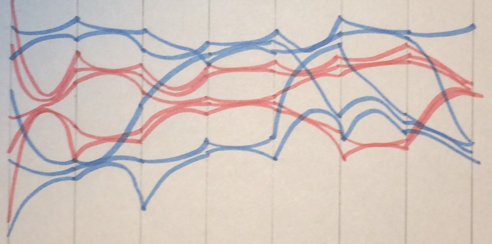

# Assignment 3: MultiD with Parallel Coordinates: Overview Technique

- [Assigment statement](https://sites.google.com/a/umbc.edu/datavisualization/assignments/assignment-3)
- [Source vis](http://pathrings.umbc.edu/tumor/)

## Part 1: Design & Discussion

### Problem to Address

The primary question I would like to address is that of showing the data distribution:

> 1). The data follows a bimodal distribution (2 peaks) on one of the variables
> (IL-5). In other words, the lines all bunched up in about two places roughly
> when we turn off some therapies, in the figure below. Other variables may
> have outliers and may follow different distributions. Parallel coordinates do
> not let one see the distribution easily.
>
> How would you visualize distributions in data on specific variables with the
> parallel coordinates? (hint (maybe): think of it this way, if you were to
> generate histogram of the distribution - the peaks and how many are in each
> peak.

### Group Idea from Class Discussion

#### Members

 - Kyle Boyer
 - Erik Sturcke

#### Idea: Edge Bundling

Inspired by [hierarchical edge bundling](https://bl.ocks.org/mbostock/7607999)
discussed in class, our group idea was to use similar techniques to group
similar edges between parallel coordinate axes. The idea is that this would
remove some of the clutter, especially when view all data points, and help
identify general trends in the data.

This would primarily hope to address issue (2):

> 2). The therapy results are overlaid on top of each other which introduces
> clutter. The body responses can be hierarchical - some responses are similar.
> How do you visually represent something similar? How might you group those
> similar items with aggregation and how to represent such an aggregation.

To some extend cleaning up the graphs might also help see bimodal distributions
of issue (1) clearer as long as the bundling is done in such a way that a
single therapy may potentially split and bundle towards multiple areas. I’m not
sure what it would entail to do this, but perhaps varying something like the
bundling strength parameter might work.

### Sketch

### Pros & Cons

#### Pros

  - Less overlap of lines between different therapies.
  - Easier to see (bimodal) distribution of therapies.
  - General cleaner aesthetic and more attractive.

#### Cons

  - No longer possible to see direct/indirect correlation between axis. This
    doesn't actually apply in the example we are working with because of the
    log scale axes.

## Part 2: Implementation

### Design Choices

Box plots capture 5 statistic for a set of values visually by length to give
some sense of the distribution. It won't show bimadal distributions, but is
well suited for Gaussian distributions. It is also fairly simple to compare to
other distributes side by side.

The initial overlapping box plots were very difficult to make sense of,
especially overlaying the parallel coordinates. Placing them side by side makes
the comparison between box plots much easier, but space is very limited with 12
distributes per attribute and 33 attribute for a total of 396 box plots on the
unfiltered data. On a standard HD display that leaves less than 5 pixels per box
plot and at that point it starts to become hard to tell which attribute the box
plots belong to.

### Steps to Produce the Visualization

### What Went Wrong?

### What to Change in the Future
