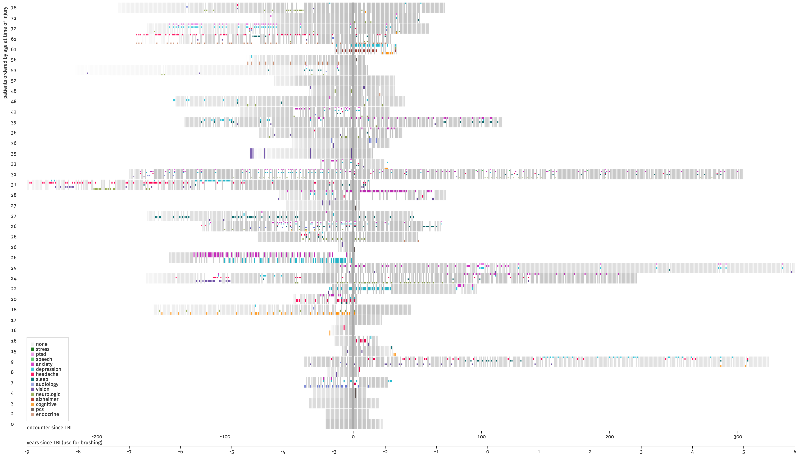

# Assignment 4: Seeing Changes in Temporal Data

[Assigment statement](https://sites.google.com/a/umbc.edu/datavisualization/assignments/assignment-4-temporal-data-visualization)  
[Group proposal](https://github.com/esturcke/cmsc-636-data-vis/tree/master/assignment-4/BoyerJusticeStoreySturckeProposal.pdf)  

## Part 1: Design & Discussion

### Change Tasks

#### Task 1

> It is possible to group these patients into cohort where each cohort shares
> similar encounters. A cohort is a group of patient with similar attributes
> (e.g., age, gender, encounters, temporal progress). What are those encounters
> that are co-occurring?

  - **Change Task 1:** Do sypmtoms co-occurring with anxiety change or remain
    the same from year 1 to year 2?
  - **Change Task 2:** Do the co-occurring symptoms subside quicker or slower
    than anxiety.

#### Task 2

> What are the new encounters patients are likely to experience? What are the
> rare encounters?

  - **Change Task 1:** What symptoms did patients experience for the first time
    after the TBI?
  - **Change Task 2:** What fraction of patients experienced those "first-time"
    symptoms after the TBI within the first year vs after more than a year?

#### Task 3

> What are the encounters repeating themselves? 

  - **Change Task 1:** For the top 3 symptoms, does the count increase or
    decrease from year 1 to year 2 for each patient?
  - **Change Task 1:** How often are those symptoms reported during the 1st and
    2nd year after the TBI?

### Encoding Choices Comparisons

#### Boyer, Justice, Storey, Sturcke

> does the design address *change* task; how would you modify the task to make it a *change* task if not

It does not really address *change*. Perhaps it should look at windows of time
to see if the rate of reporting a given symptom was increasing or decreasing
rather than just considering the start and end times.

> how many items can the design show on a 24-inch monitor?

Encounters are displayed along the horizontal axis and so are limited by
horizontal pixels and so will be on the order of 1000. Symptoms are displayed
vertically by a short bar and so *patient* × *symptoms* will be on the order of
a few 100.

> does it use overview+detail technique?

As described it is only an overview technique although there are many targets
that could show details for encounters.

> does it show "temporal" changes?

Yes, it shows each encounter distributed horizontally by time from TBI.

> whether or not it introduces clutter by comparing with all other designs

It uses minimal ink and overall very little clutter. However, since the
horizontal is time relative to TBI and the encounters span 15 years or over
5400 days, each pixel corresponds to almost 3 days on an HD display. For many
patients there were times where the encounter density exceeded 1 encounter in 3
days and so individual encounters would not be able to always be discerned.
Using opacity, however, would be able to show these clusters are darker.

> is the design visually pleasing?

Yes, it is very pleasing 😁

## Part 2: Implementation

[Online demo](https://sturcke.co/cmsc-636/4-ehr/)

### Design Choices

Although the problem statement asked to order the patients by ID vertically I
chose to use a different order. Using position seems wasted on nominal values.
I chose to order the patients by age. This makes at least partial use of a
visual encoding well suited for quantitative attributes. 

Rather than using black to indicate encounters without symptoms, I used a much
lighter gray so that they would not dominate visually compared to encounters
with symptoms.

For color palette, I used [Colorgorical](http://vrl.cs.brown.edu/color). It
takes not only the perceptual distance between colors into account, but also
pair preference. Additionally, it let's you specify a relatively narrow
lightness range so that we can still use lightness for encoding. Finally, it
can generate palettes beyond 12 colors unlike
[Colorbrew](http://colorbrewer2.org/#type=sequential&scheme=BuGn&n=3).

###  Critical Evaluation

#### Change Task 1

> How have the encounters reduced between the first and the second three months? 

...

#### Change Task 2

> How have the frequency of encounters (hospital visits) changed from the first to the second three months? 

...

#### Pros

  - This method is very scalable so that every symptom on every encounter gets at least 5 × 5 pixels.
  - Filtering by symptom helps focus on certain data.
  - Aligning symptoms per patient vertically helps track trends over time.

#### Cons

  - Vertical axis show ordinal encounter number relative to TBI, but change tasks are temporal
  - Even with brushing and filtering, the visualization does not let you compare two time periods simultaneously.
  - With 14 symptoms, we are reaching the limits of usefulness of color for
    categorical data, especially since some patients had 9 symptoms and so some
    symptoms are represented by only 5 vertical pixels.
