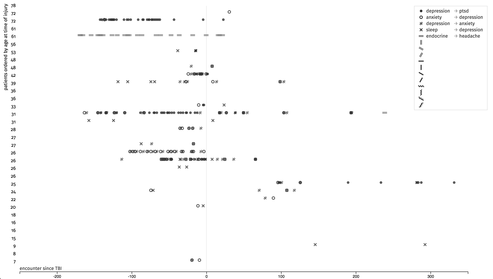
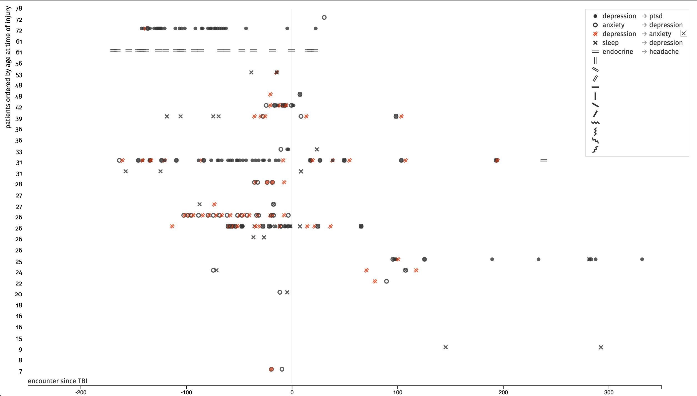
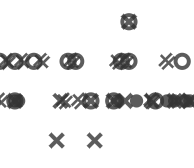
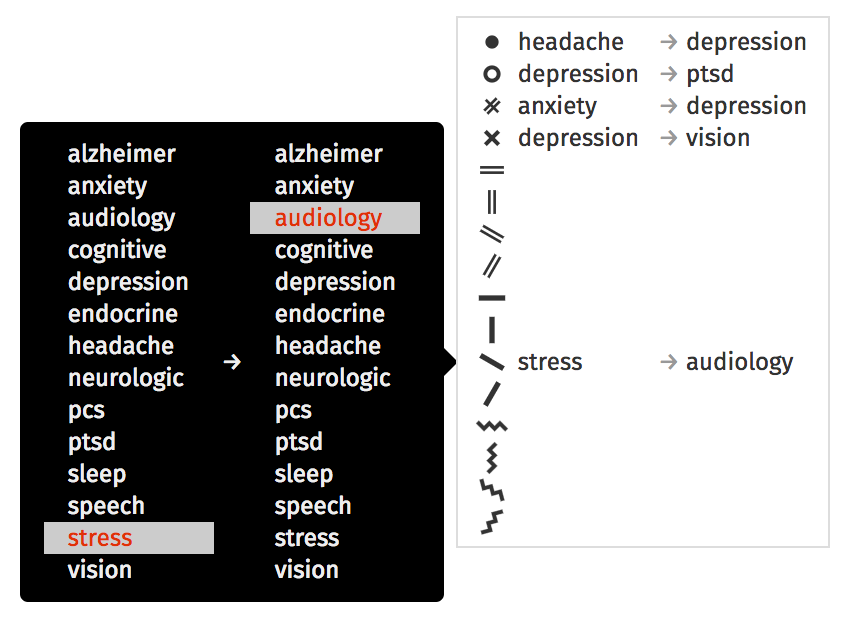

# Assignment 5: Highlight Temporal Trajectories

[Assigment statement](https://sites.google.com/a/umbc.edu/datavisualization/assignments/assignment-5)  
[Live Demo](https://maiholz.org/temporal-trajectories/)

## Setup

This projects requires [`Yarn`](https://yarnpkg.com/) (or npm) to install dependencies using:

```
yarn
```

## Preprocessing

### Assumptions

Given a sequence `A → B`, we have to search for encounter trajectories where
the patient exhibited the given symptoms. I will assume that we are not
considering co-occurrence of the symptoms to be a trajectory, but that symptoms
need not be for consecutive encounters. I will also assume that when looking
for multiple trajectories, they may overlap. A single trajectory, however, will
not be allowed to overlap with itself. When considering the extend of a
trajectory, the only the nearest symptoms are considered part.

For example when looking for

```
1. A → B
2. C → B
3. D → E
```

in 

```
AACBCDEB
```

the trajectories would be

```
A[ACB]CDEB 1
AA[CB]CDEB 2
AACBC[DE]B 3
AACB[CDEB] 2  
```

The order of the trajectories is determined by the completion of the trajectory.

### Finding Trajectories

The code to find the trajectories is in
[`src/lib/trajectories.js`](src/lib/trajectories.js). Given a
`from` and `to` symptom along with the `ehs.json` patient data, this code finds
all the transition encounter pairs for the trajectory.

The trajectory data is written to
[`data/trajectories.json`](data/trajectories.json) via
[`tools/trajectories.js`](tools/trajectories.js) and can be run via:

```bash
yarn trajectories
```

## Visualization

Per the assignment, the symbols follow a system given by Jacques Bertin in
*Semiology of Graphics: Diagrams, Networks, Maps*. The claim is that the symbols
are easily distinguishable, yet none are visual salient. The SVG for the
symbols were written by hand.


Each symbol can be assigned to an ordered pair of symptoms describing a
trajectory. The vertical axis are patients ordered by age at the time of the
injury. Horizontally, the symbols are placed according to encounter relative to
the injury.



The trajectories were all precomputed as part of the first part of the
assignment.

There's significant overlap and so I added the ability to hover over the legend
to highlight the given symbol in the visualization.



## Critical Evaluation

The first claim is that using this system of symbols is no visual saliency, yet
still visually distinguishable. The second is that is an effective way to
highlight temporal changes in symptoms.

I do agree that between the symbols themselves, none are visually salient. They
are also remain visually distinguishable even down to sizes of around 5px on an
HiDPI screen. 

The problem comes with high density areas. The symbols run together and become
very hard to distinguish. Additionally, these high density areas become very
salient. 



In terms of effectiveness, I was not able to gain any new understanding of the
data using this visualization. Patients vary considerably in terms of symptoms.
One thing that did stand out again is that there seems to be a bias towards
symptoms prior to the first TBI. Perhaps this is because there was loss of life,
or simply the end of when data was collected for this data set. Perhaps also
the TBI resulted in removal from combat and so while the patient might still be
seeking treatment for the TBI, they have fewer other reasons to have
encounters.

### Pros

  - Not visually salient yet still distinguishable even at small sizes on HiDPI
    screens
  - Black and white and so suitable print and also freeing up color for other
    encoding

### Cons

  - High density areas are very hard to tell what's going on
  - Was not able to discover any interesting trends across patients

## Extra Credit

Clicking on a row in the legend allows the user to pick the pattern to mark
with the symbol.


